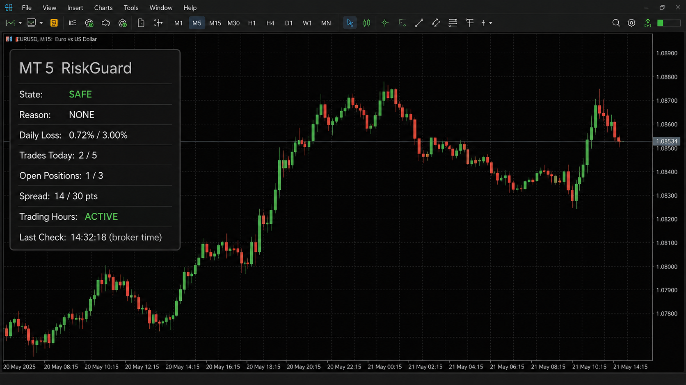

# MT5 RiskGuard

[](https://www.metatrader5.com/)
[](https://www.mql5.com/)
[](LICENSE)
[](https://github.com/Dev-Art-Solutions/RiskGuard/actions/workflows/quality.yml)

**Deterministic risk controls for MetaTrader 5.**

MT5 RiskGuard is a lightweight MQL5 Expert Advisor that continuously monitors an MT5 account and enforces configurable risk policies independently from trading strategy logic.

Trading strategies answer, “When should I trade?” RiskGuard answers, “Should this account be allowed to take more risk right now?”



_Privacy-safe portfolio mockup. The running EA renders the same metrics from live terminal data; no account or broker identity is shown._

## Core controls

| Guard | Purpose | Result |
|---|---|---|
| Daily loss | Locks the broker day after the equity-loss threshold is reached | `BLOCKED` |
| Risk per trade | Estimates loss at stop using `OrderCalcProfit` | `BLOCKED` when excessive or unsafe |
| Open positions | Limits simultaneous in-scope exposure | `RESTRICTED` |
| Trades per day | Counts unique entry orders, excluding exit-only deals | `BLOCKED` |
| Session | Uses broker/server time and supports overnight sessions | `RESTRICTED` |
| Spread | Detects poor execution conditions on the attached symbol | `RESTRICTED` |
| Emergency stop | Provides an explicit highest-priority lockdown | `EMERGENCY` |

State priority is deterministic:

```text
EMERGENCY > BLOCKED > RESTRICTED > SAFE
```

All active violations remain visible even when a higher-priority state wins.

## How enforcement works

RiskGuard continuously monitors the account and enforces configured risk policies within the capabilities of MetaTrader 5. It can optionally close in-scope positions after an emergency stop or daily-loss breach. Both destructive actions are disabled by default. When enabled, liquidation is limited to three persisted close batches separated by at least five seconds; each target symbol selects its own supported filling mode immediately before the close request.

An EA attached to one chart cannot guarantee pre-trade interception of every manual order or order sent by an unrelated EA. `SAFE`, `RESTRICTED`, and `BLOCKED` communicate whether new risk is permitted by policy; execution code that needs strict pre-trade gating should consult equivalent checks before sending its own orders.

## Risk definitions

### Daily loss

The daily baseline is the account equity observed at the first RiskGuard check of the broker day:

```text
Daily Loss % = max(0, (Start-of-Day Equity - Current Equity) / Start-of-Day Equity × 100)
```

The baseline and breach lock are stored in MT5 terminal global variables keyed by a deterministic server-identity hash, account login, scope, and broker date. Restarting the EA therefore does not reset an existing baseline or unlock a breached day, while equal login numbers on different servers remain isolated. Safety-critical writes are verified and flushed. A failed baseline or daily-lock persistence operation forces `BLOCKED` rather than silently weakening restart safety.

If RiskGuard was not running at the start of a day and no saved baseline exists, its first observed equity becomes that day's baseline; exact earlier intraday equity cannot be reconstructed from deal history alone.

### Position risk

For each in-scope position, monetary loss at the configured stop-loss is estimated with the platform's `OrderCalcProfit`, using symbol contract rules, entry price, stop price, and current volume. The percentage denominator is current account equity.

- A missing stop-loss is `BLOCKED` when `RejectTradesWithoutSL=true`.
- With explicit opt-out, a missing stop-loss still produces `RESTRICTED`; it is never reported as zero risk.
- Any other failed/invalid calculation produces `BLOCKED`.

### Trades per day

One unique entry order (`DEAL_ENTRY_IN` or `DEAL_ENTRY_INOUT`) is one trade. Multiple partial fills for the same order are de-duplicated. Exit-only deals and partial closes do not count. The count is rebuilt from MT5 history on every evaluation, so it survives restarts.

If broker-day history cannot be selected, RiskGuard enters `BLOCKED` with `TRADE_HISTORY_UNKNOWN`; an unknown count is never assumed to be zero.

## Scope

`MagicNumberFilter=0` means all account positions and entry deals are in scope. A positive value limits position, trade-count, position-risk, and liquidation logic to that magic number. Daily equity loss remains account-level because MT5 equity is account-level.

Run only one account-wide instance per account. Attach it to the symbol whose spread should be monitored.

## Installation

1. Open the MT5 data folder (`File` → `Open Data Folder`).
2. Copy `src/RiskGuard.mq5` into `MQL5/Experts/RiskGuard/`.
3. Open the source in MetaEditor and compile it.
4. Attach RiskGuard to one chart.
5. Review every input, then enable Algo Trading if opt-in liquidation is required.
6. Configure MT5 notifications separately before enabling push notifications.

The example [`examples/conservative.set`](examples/conservative.set) is a starting point only, not a universal recommendation.

## Configuration

| Input | Default | Meaning |
|---|---:|---|
| `MaxDailyLossPercent` | `3.0` | Persistent broker-day equity loss lock |
| `MaxRiskPerTradePercent` | `1.0` | Maximum estimated stop-loss risk vs current equity |
| `MaxOpenPositions` | `3` | In-scope simultaneous position limit |
| `MaxTradesPerDay` | `5` | Unique in-scope entry orders per broker day |
| `RejectTradesWithoutSL` | `true` | Treat missing SL as a hard violation |
| `UseTradingHours` | `true` | Enable broker-time session guard |
| `TradingStart*` / `TradingEnd*` | `08:00–18:00` | End is exclusive; equal times mean 24 hours |
| `MaxSpreadPoints` | `30` | Maximum attached-symbol spread in points |
| `EmergencyStop` | `false` | Highest-priority manual lockdown |
| `ClosePositionsOnEmergencyStop` | `false` | Opt-in scoped liquidation |
| `ClosePositionsOnDailyLossBreach` | `false` | Opt-in scoped liquidation |
| `MagicNumberFilter` | `0` | `0` = account-wide; positive = matching magic only |

Invalid percentages, limits, times, spread, or magic settings fail initialization clearly.

## Architecture

```text
MT5 account + broker time + deal history
                    │
                 RiskGuard
    ┌───────────────┼────────────────┐
    │ Daily loss    │ Position risk  │ Trade count
    │ Position cap  │ Session guard  │ Spread guard
    └───────────────┼────────────────┘
             Emergency controller
                    │
       SAFE / RESTRICTED / BLOCKED / EMERGENCY
                    │
         panel + audit log + alert + optional close
```

The implementation intentionally remains in one auditable source file: [`src/RiskGuard.mq5`](src/RiskGuard.mq5).

## Validation

Repository invariant checks and real compiler validation are deliberately separate.

## Verified with MetaTrader 5

- MetaEditor 5 build 6182 compile: **0 errors / 0 warnings**.
- Repository safety/invariant checks: passing.
- VS Capital demo-backed Strategy Tester validation: `SAFE`, `RESTRICTED`, and `EMERGENCY` passed on the final binary; `BLOCKED` and liquidation paths remain pending.

See [`docs/validation/README.md`](docs/validation/README.md), the sanitized [`metaeditor-compile.log`](docs/validation/metaeditor-compile.log), and [`demo-state-validation.log`](docs/validation/demo-state-validation.log). Runtime scenarios are specified in [`docs/TEST_PLAN.md`](docs/TEST_PLAN.md).

## Important limitations

- RiskGuard is monitoring and reaction software, not a broker-side risk engine.
- It cannot guarantee interception of manual or unrelated-EA orders before execution.
- The daily baseline is exact only after the first saved observation for that broker day.
- Risk estimates require valid symbol metadata and stop information.
- Position-close requests can be rejected by the terminal, market, or broker; every attempt/result is logged.
- Bounded retries improve temporary-failure handling but cannot guarantee that a broker accepts a close request.
- This software is not financial advice and does not guarantee profitability or prevent all losses.
- Test on a demo account before considering live use.

## Dev Art Solutions

Built by **Dev Art Solutions — Trading Systems Engineering**<br>
[devart.solutions](https://devart.solutions)

See the [`PORTFOLIO_CASE_STUDY.md`](PORTFOLIO_CASE_STUDY.md) for engineering decisions and client-relevant applications.

## Dev Art Solutions Trading Systems

Part of the Dev Art Solutions trading systems portfolio:

- [TradeAudit](https://github.com/Dev-Art-Solutions/TradeAudit) -- post-trade analytics and behavioral intelligence
- MT5 RiskGuard -- native MQL5 risk controls
- [MT5 Execution Bridge](https://github.com/Dev-Art-Solutions/MT5-Execution-Bridge) -- local-first Python <-> MT5 execution infrastructure

https://trading.devart.solutions

## License

MIT — see [`LICENSE`](LICENSE).
